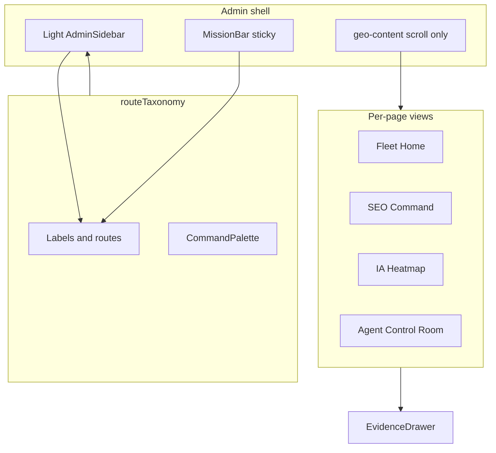

# Admin dashboard UI redesign — implementation plan

## Repository reality (inspected)

- **Shell entry:** [`features/admin/dashboard/shared/layout/AdminWorkspaceLayout.jsx`](features/admin/dashboard/shared/layout/AdminWorkspaceLayout.jsx) composes `.geo-shell` → `AdminSidebar` → `.geo-main` → `ShellChrome` (MissionBar + `CommandPalette`) → `.geo-content` → children. This matches [AGENTS.md](AGENTS.md): **only `.geo-content` scrolls**; pages must not add `h-screen` / page-root `overflow-y-auto`.
- **Styling:** [`features/admin/dashboard/shared/admin-shell.css`](features/admin/dashboard/shared/admin-shell.css) is a **dark** token system (`--cmd-bg` etc.). A light redesign means **new surface tokens** (CSS variables + Tailwind where used) while keeping the **same layout class names** (`geo-shell`, `geo-main`, `geo-content`, `geo-sb`) so scroll behavior stays intact.
- **Navigation source of truth:** [`features/admin/dashboard/shared/components/shell/routeTaxonomy.js`](features/admin/dashboard/shared/components/shell/routeTaxonomy.js) feeds **sidebar, MissionBar, CommandPalette**. Labels and any new routes must be updated here first.
- **Many client pages** render through [`ProfessionalSectionView.jsx`](features/admin/dashboard/shared/components/operator/ProfessionalSectionView.jsx), which centralizes SEO/GEO/Agent “overview” style layouts—this is the main source of **repeated hero + KPI + table** patterns you want to escape. Long term, **page files should import dedicated view components** per route and slim `ProfessionalSectionView` to a thin router or remove it.
- **Evidence:** [`EvidenceDrawer.jsx`](features/admin/dashboard/shared/components/operator/EvidenceDrawer.jsx) + `UrlEvidenceDrawer` already exist; extend slots (summary, provenance, history, verification) rather than inventing a second drawer system.
- **Charts:** `recharts` is in [`package.json`](package.json)—reuse for “beautiful charts” with light-theme axes/tooltips.
- **Benchmark doc:** [`docs/dashboard-redesign-benchmark-2026.md`](docs/dashboard-redesign-benchmark-2026.md) aligns with: command palette, provenance, empty/degraded states, drilldown. Your spec adds **distinct layout metaphors per page**—consistent *questions* (healthy? degraded? next step?) but **different visual grammar** per screen.

## Strategic approach

### 1) Design tokens (light + service colors)

Add a **parallel token layer** (e.g. `--admin-surface`, `--admin-text`, `--svc-seo-*`, `--svc-geo-*`, `--svc-agent-*`, semantic `--status-critical` etc.) in `admin-shell.css` (or a dedicated `admin-shell-light.css` imported after the layout file’s existing import). Map:

- **SEO / Google:** blue + green accents (borders, chart series, active nav pill)—not full-screen tint; keep main canvas light neutral.
- **IA / GEO:** violet + cyan.
- **Agent:** orange + indigo (relabel UI from “Exécution” where you want “Agent” as the product surface—**label-only** in taxonomy; no route renames).
- **Semantic:** soft red / amber / green / slate per your list.

Update `SECTION_THEME` in [`AdminSidebar.jsx`](features/admin/dashboard/shared/components/AdminSidebar.jsx) from neutral placeholders to real service accents (still **no neon**; use muted premium saturations).

### 2) Shell rebuild (light sidebar + topbar)

Files: [`AdminSidebar.jsx`](features/admin/dashboard/shared/components/AdminSidebar.jsx), [`MissionBar.jsx`](features/admin/dashboard/shared/components/shell/MissionBar.jsx), [`ShellChrome.jsx`](features/admin/dashboard/shared/components/shell/ShellChrome.jsx), [`admin-shell.css`](features/admin/dashboard/shared/admin-shell.css).

- **Sidebar:** light surface, subtle border, **client switcher** remains in MissionBar context (already loads clients via `loadShellContext`); ensure contrast for active/locked subscription states.
- **Sticky topbar:** MissionBar is the right anchor—extend with **date range** (client + URL state via searchParams where pages already support it; otherwise local UI state + `router` for deep links), **service status chips** (from existing `ClientContext` / slices if available; else **degraded/placeholder** with honest empty states per benchmark).
- **⌘K:** keep [`CommandPalette`](features/admin/dashboard/shared/components/shell/CommandPalette.jsx); extend entries when `routeTaxonomy` grows.
- **Denied / sign-in:** leave auth gate styling for a follow-up unless it must match the light shell (optional pass; not required for operator workspace).

### 3) Navigation model (global + three services)

Update [`routeTaxonomy.js`](features/admin/dashboard/shared/components/shell/routeTonomy.js) **labels and groupings** to match your IA structure. **Keep existing URL paths** unless you add **redirect-only aliases** (your rule).

Suggested **label mapping** (paths unchanged):

| Your label | Existing path / note |
|------------|---------------------|
| SEO / Google section | `/seo/*` |
| IA / GEO section | `/geo/*` |
| Agent section | `/agent/*` (rename **Exécution → Agent** in UI copy) |
| Home | `/admin` |
| Clients | `/admin/clients` |
| Client Overview | `/admin/clients/[id]` (mandate atrium) |
| Client Dossier | `/admin/clients/[id]/dossier` |
| Reports | No global `/admin/reports` today—use **client** [`/dossier/audit`](app/admin/(workspace)/clients/[clientId]/dossier/audit/page.jsx), activity, comparison; optional **portfolio** “Reports” linking to filtered clients or a future hub (UI-only stub that lists deep links, not new backend). |
| Connectors | `/dossier/connectors` |
| Settings | `/dossier/settings` or `/clients/[id]/settings` (both exist—pick one primary in nav, keep other reachable). |

Subnav: extend `CLIENT_ROUTES` only when you add **redirect-only** aliases; otherwise reorder/relabel to your list (e.g. **Provider Compare** → existing `geo/compare`; **Monitoring** → `geo/continuous`; **Raw Answers** → `geo/reponses-preuves`).

**Missing route:** **Agent → Workflows** — add [`app/admin/(workspace)/clients/[clientId]/agent/workflows/page.jsx`](app/admin/(workspace)/clients/[clientId]/agent/workflows/page.jsx) in Phase 3 with a client-only workflow canvas view (UI-first; mock graph if no API).

### 4) Component system (reusable but not uniform)

New or extended under [`features/admin/dashboard/shared/components/`](features/admin/dashboard/shared/components/) (exact filenames TBD during implementation):

- `ServiceShell` / `ServiceMasthead` — optional thin wrapper applying service tokens + section subnav highlight.
- **Badges:** `StatusBadge`, `ProvenanceBadge` (data: source, freshness, sample size).
- **Primitives:** `MetricTile`, `GaugeCard`, `HeatmapGrid`, `MatrixView`, `ActionBoard`, `Timeline`, `LogExplorerShell`, `WorkflowCanvasShell`, `SplitPanel`, `MapPanel` (Local page).

**Rule:** primitives are **stylistically consistent**; each page **composes a different primary focal** (gauge vs heatmap vs map vs board vs matrix).

### 5) Animation (150–250ms)

Use CSS `transition` + existing `framer-motion` where already in sidebar; **drawers**: translate-X from right on `EvidenceDrawer` / panels; **no looping** decorative motion. Chart anim: Recharts `isAnimationActive` on filter change.

### 6) Empty / degraded states

Centralize copy patterns in a small `OperatorDataState` helper (or extend [`OperatorState`](features/admin/dashboard/shared/components/operator/OperatorState.jsx)): connector missing, no runs, stale, partial, parse failed—each with **primary CTA** (connect, run audit, rerun, etc.), per benchmark §1.1 and your list.

---

## Phase 1 (MVP): shell + five surfaces

**Goal:** New light shell + service nav + **visually distinct** layouts for: **Operations Home**, **Client Dossier** (and align **Client Roster**), **SEO Overview**, **IA Overview**, **Agent Overview**.

| Page | Primary layout metaphor (unique) | Main files to touch |
|------|-----------------------------------|---------------------|
| Global Operations Home | **Fleet status board:** alert strip, health mosaic, action board by service, activity timeline | [`AdminDashboardPage.jsx`](features/admin/dashboard/home/AdminDashboardPage.jsx) / [`MandateAtriumView.jsx`](features/admin/dashboard/home/MandateAtriumView.jsx) |
| Client Roster | **Card gallery + filters:** left filter rail, cards with service badges + sparklines | [`app/admin/(workspace)/clients/page.jsx`](app/admin/(workspace)/clients/page.jsx) + portfolio components colocated under `features/admin/dashboard/clients/` or `home/` |
| Client Dossier | **Case file cover:** identity header, 3 service panels, evidence timeline, next actions | [`features/admin/dashboard/dossier/`](features/admin/dashboard/dossier/) entry view (whichever powers [`/dossier`](app/admin/(workspace)/clients/[clientId]/dossier/page.jsx)) |
| SEO Overview | **Command center:** large visibility gauge, benchmark gauges, trend strip, dense table, drawer for row | Replace generic SEO overview branch in [`ProfessionalSectionView.jsx`](features/admin/dashboard/shared/components/operator/ProfessionalSectionView.jsx) with new `SeoOverviewCommandView.jsx` (or similar) imported from [`seo/page`](app/admin/(workspace)/clients/[clientId]/seo/page.jsx) |
| IA Overview | **Heatmap-first:** topic × provider matrix, stories panel, trend strip | New `GeoOverviewHeatmapView.jsx` + wire [`geo/page.jsx`](app/admin/(workspace)/clients/[clientId]/geo/page.jsx) |
| Agent Overview | **Control room:** three dials (Visibility, Readiness, Actionability), protocol grid, incidents, next fixes | New `AgentOverviewControlRoomView.jsx` + [`agent/page.jsx`](app/admin/(workspace)/clients/[clientId]/agent/page.jsx) |

**Data:** keep existing loaders (`listOperatorClients`, `useSeoWorkspaceSlice` / `useGeoWorkspaceSlice`, etc.); only change **presentation** and **prop plumbing** if a component needs a field already on the slice.

---

## Phase 2

Unique layouts for: **SEO Technical Health**, **SEO Content Inventory**, **IA Raw Answers**, **IA Sources & Citations**, **Agent Protocols**, **Agent Logs**—each following your numbered briefs. Reuse drawers; add heatmap/matrix/map where specified.

---

## Phase 3

**SEO Local**, **IA Competitors**, **IA Provider Compare** (enhance existing compare UIs), **Agent Workflows** (new route + canvas), remaining “advanced” pages (cannibalization matrix, assisted fixes board, etc.).

---

## How each page stays visually unique (summary)

Use **one dominant pattern** per page: **gauge** (SEO overview), **heatmap** (IA overview), **diagnostic treemap / segmented map** (technical health), **map-first** (local), **dense inventory table + hub tiles** (content), **matrix** (cannibalization), **Kanban** (assisted fixes), **quadrant + queue** (opportunities), **split raw viewer** (raw answers), **column compare** (provider compare), **influence matrix** (sources), **bars + radar** (competitors), **timeline + bot cards** (crawlers), **graph + JSON-LD drawer** (schema), **split editor** (llms.txt), **alert feed** (alerts), **log explorer** (observability), **node canvas** (workflows). Shared tokens only.

---

## Files likely to change (high level)

- Shell & chrome: [`AdminWorkspaceLayout.jsx`](features/admin/dashboard/shared/layout/AdminWorkspaceLayout.jsx), [`admin-shell.css`](features/admin/dashboard/shared/admin-shell.css), [`AdminSidebar.jsx`](features/admin/dashboard/shared/components/AdminSidebar.jsx), [`MissionBar.jsx`](features/admin/dashboard/shared/components/shell/MissionBar.jsx), [`ShellChrome.jsx`](features/admin/dashboard/shared/components/shell/ShellChrome.jsx), [`routeTaxonomy.js`](features/admin/dashboard/shared/components/shell/routeTaxonomy.js), [`CommandPalette`](features/admin/dashboard/shared/components/shell/CommandPalette.jsx) (if new routes).
- Core page hosts: [`ProfessionalSectionView.jsx`](features/admin/dashboard/shared/components/operator/ProfessionalSectionView.jsx) (shrink over time), individual `app/admin/(workspace)/clients/[clientId]/.../page.jsx` files as they switch to dedicated views.
- New view modules: under `features/admin/dashboard/seo/`, `geo/`, `agent/`, `home/`, `dossier/` as needed.
- Drawers: [`EvidenceDrawer.jsx`](features/admin/dashboard/shared/components/operator/EvidenceDrawer.jsx) (props/sections).

---

## Risks and mitigations

- **Scroll regression:** never add `overflow-y-auto` on page roots inside `.geo-content`; test long pages after each shell change.
- **Contrast / charts:** light theme needs **adjusted** grid/axis colors and series colors per service—test Recharts with new tokens.
- **Scope creep:** **no backend changes** unless a page cannot read an already-exposed field; use honest empty states instead of new APIs.
- **Benchmark tension:** doc §3.3 (Datadog) suggests uniform dashboards; your spec requires **layout variety**—resolve by **shared components, unique composition** (same questions, different primary visual).

---

## Validation (when implementing)

- `npm run lint` and targeted manual pass on `/admin`, `/admin/clients`, one client’s SEO/GEO/Agent overviews.
- Keyboard: ⌘K still opens command palette.
- No git commit / push / PR per your instructions.

